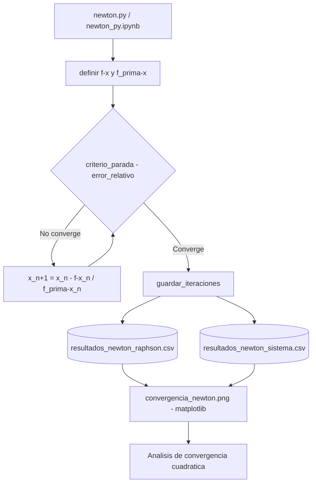

# Búsqueda de Raíces Reales — Métodos Numéricos Iterativos

> Búsqueda de raíces de funciones reales con el método de Newton-Raphson: análisis de convergencia y criterios de parada.

## Descripción

---

Implementación y análisis del **método de Newton-Raphson** para búsqueda de raíces reales. Se estudia la convergencia cuadrática del método, se implementan criterios de parada por error relativo y se comparan las tasas de convergencia para diferentes funciones y puntos de partida iniciales.

## Contenido del repositorio

| Archivo | Descripción |
|---|---|
| `convergencia_newton.png` | Gráfica de convergencia del método |
| `Tabla en Excel.xlsx` | Tablas de iteraciones y errores |
| `*.pdf` | Informe con análisis matemático |

## Arquitectura

## Formula de Newton-Raphson

La iteración se define como: **x_{n+1} = x_n - f(x_n) / f_prima(x_n)**

La convergencia es de orden cuadrático cuando la derivada en la raíz es distinta de cero. El criterio de parada es el error relativo entre iteraciones consecutivas.

## Contexto académico

**Asignatura:** Métodos Numéricos · **Institución:** Ingeniería Informática
**Autor:** Alejandro De Mendoza — Ingeniero Informático · Especialista Ingeniería de Software

---

## Autor

**Alejandro De Mendoza**  
Ingeniero Informático · Especialista en IA · Especialista en Ingeniería de Software · Máster en Arquitectura de Software

